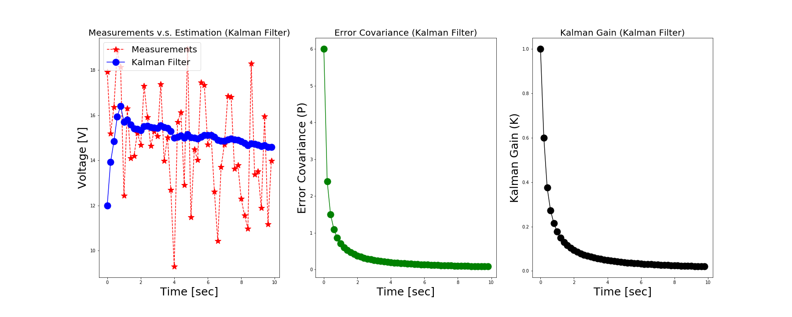

# 칼만 필터 (Kalman Filter)
"[칼만 필터는 어렵지 않아 (저자: 김성필 님)](http://www.hanbit.co.kr/store/books/look.php?p_code=B4956047798)"에서 소개된 예제 코드를 파이썬으로 구현합니다.

* 알고리즘은 동일하지만 파이썬으로 구현하다 보니 책의 예시와 다른 부분이 있을 수 있습니다.
* 데이터는 저작권 보호를 위해 아래 "데이터 준비"에 따라 [공식 자료실](http://www.hanbit.co.kr/support/supplement_list.html)에서 다운로드하셔야 합니다.
* "Part 02. 칼만 필터 기초"에는 예제 문제가 포함되어 있지 않습니다.



## 목차 (Contents)
* Part 01. 재귀 필터 (Recursive Filter)
  + [Chapter 01. 평균 필터 (Average Filter)](./Ch01.AverageFilter)
  + [Chapter 02. 이동평균 필터 (Moving Average Filter)](./Ch02.MovingAverageFilter)
  + [Chapter 03. 저주파 통과 필터 (Low Pass Filter)](./Ch03.LowPassFilter)
* Part 02. 칼만 필터 기초 (Basic Kalman Filter)
  + Chapter 04. 칼만 필터 (Kalman Filter)
  + Chapter 05. 추정 과정 (Estimation)
  + Chapter 06. 예측 과정 (Prediction)
  + Chapter 07. 시스템 모델 (System Model)
* Part 03. 칼만 필터 응용 (Application)
  + [Chapter 08. 초간단 칼만 필터 예제 (Simple Example)](./Ch08.SimpleKalmanFilter) -> 작업 중... (While at work...)

## 데이터 준비 (Prerequisite)
* 아래 스크립트를 사용하여 데이터를 [공식 자료실](http://www.hanbit.co.kr/support/supplement_list.html)에서 다운로드한 후 "data" 디렉터리로 옮깁니다.

```bash
$ ./download_dataset.csh
```

## 참고 자료 (Reference)
* [칼만 필터는 어렵지 않아 with MATLAB Examples (저자: 김성필 님)](http://www.hanbit.co.kr/store/books/look.php?p_code=B4956047798)
* [MATLAB 소스 코드 및 데이터 (한빛출판네트워크 자료실)](http://www.hanbit.co.kr/support/supplement_list.html)
